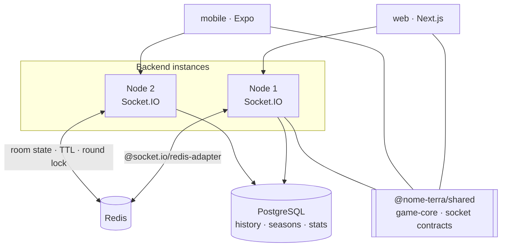

# Nome Terra

Architecture showcase for a realtime multiplayer word game. The implementation is
private; this repository documents the system design.

**Live:** [nometerra.kingdevil731.dev](https://nometerra.kingdevil731.dev) (beta)

---

## The game

Players join a room, vote on which categories to play, receive a random letter,
and submit one answer per category under a timer. Everyone then reviews everyone
else's answers and votes out invalid ones. Scores account for unique answers,
duplicates between players, and entries voted invalid. Repeat across rounds and
seasons.

It is the Portuguese/Brazilian game _Stop!_ — known locally as Nome Terra — which
matters architecturally because the rules are fixed and well known. Players
notice immediately if scoring is wrong, and a scoring disagreement mid-round is
the failure that loses a lobby.

## Shape

Turborepo with pnpm workspaces. Four packages: `nome-terra-backend` (Express,
Socket.IO, Prisma), `nome-terra-web` (Next.js), `nome-terra-shared`, and
`nome-terra-mobile` (Expo Router, not yet in the workspace build).



## Three things worth reading about

### 1. The rules are a pure package both sides import

`game-core` is the layer this design rests on. Eight modules — `scoring`,
`grouping`, `review`, `validate`, `normalize`, `letters`, `stop`, `blocklist` —
with zero runtime dependencies and a hard constraint stated at the top of the
package:

> No `Date.now`, no `Math.random`, no I/O, no framework imports: time and
> randomness are injected so every rule is deterministically testable and any
> disputed round is reproducible from its persisted seed.

Both the server and the clients import it, and nothing in it may be
reimplemented anywhere else. That is what stops the classic multiplayer failure
where the client's idea of a score and the server's slowly diverge, because there
is only one implementation of the rules in the system.

Injecting the randomness is the part that earns its place. A round's letter comes
from a seed that is persisted, so a player disputing a result is not a matter of
opinion — the round can be replayed exactly. Every module has its own test file.

→ [Realtime model](docs/realtime-model.md)

### 2. Room writes are serialised by an explicit lock, and the code says so

Room mutation is read-modify-write and the store has no version field. Instead of
versioning the store, every write path takes a distributed mutex — `SET NX PX`
with a random token, released through a Lua compare-and-delete so a holder whose
lock has already expired cannot delete a lock another instance now owns.

The discipline is visible in the naming. Entry points call
`acquireRoundLockWaiting(roomId)`; internal operations that assume the lock is
already held are named for it — `startGameWithLockHeld`, `endRoundWithLockHeld`,
`finalizeRoundWithLockHeld`, `advanceReviewWithLockHeld` and five more. You
cannot call one by accident and not notice.

It is not only `GameService`. `RoomService`, `LobbyService` and `PresenceService`
take the same lock, and there is a test asserting exactly why:

> Every service that writes a room takes the same round lock GameService does.
> Redis hands each caller its own copy, so an unlocked write that read before a
> locked one saved puts the old room back.

→ [Engineering decisions](docs/decisions.md)

### 3. Nothing a client sends happens twice

`IdempotencyStore.once(key, fn)` runs an action once and replays the stored
result for a repeated key. A duplicate `round:stop` from a double-tap or a
retried emit is a no-op rather than a second state transition.

That pairs with acknowledgements on the socket layer. Handlers are wrapped so a
thrown error becomes a structured negative ack rather than a lost event:

```ts
export function wrapAck<TPayload, TAck = unknown>(
  fn: (payload: TPayload, ack?: (res: TAck) => void) => Promise<void>,
) {
  return (payload: TPayload, ack?: (res: TAck) => void) => {
    fn(payload, ack).catch((e) => {
      ack?.({ ok: false, error: (e as Error).message || "UNKNOWN" } as TAck);
    });
  };
}
```

Fire-and-forget emits are how realtime games become unexplainable: a submission
vanishes with no error, the client shows state the server does not have, and the
player finds out at scoring. Acks make the failure addressable at the call site;
idempotency makes the retry safe.

## Production refuses to degrade silently

Both the socket adapter and the room repository check for `REDIS_URL` and behave
differently by environment:

```ts
if (!env.REDIS_URL) {
  if (env.isProduction) {
    console.error(
      "[repo] production fallback prevented: Redis room repo requires REDIS_URL",
    );
    throw new Error("REDIS_URL_REQUIRED_FOR_PRODUCTION_ROOM_REPO");
  }
  console.warn(
    "[repo] Redis room repo disabled; using InMemoryRoomRepo for non-production",
  );
  return new InMemoryRoomRepo();
}
```

The in-memory fallback is a real convenience locally. In production the same
fallback is a trap: the server boots, looks healthy, works under one instance,
and loses rooms the moment a second appears or the process restarts. Crashing at
boot is louder and cheaper than debugging that from a bug report.

## Testing

78 test files. The weighting is deliberate: the pure rules layer is covered
module by module, and the stateful paths are covered by behaviour — reconnection,
presence lifecycle, seat holds, idle detection, rematch, under-two-player
shutdown, abandoned-room outcomes, and a dedicated lock race test.

Guardrail tests are used where a convention matters more than a unit:
`prismaImports.guardrail.test.ts` and `theme.guardrail.test.ts` fail the build
when someone imports around a boundary rather than through it.

## Structure

```
nome-terra-shared/src/game-core/   scoring · grouping · review · validate
                                   normalize · letters · stop · blocklist
nome-terra-backend/src/
  realtime/gateways/handlers/      lobby · rooms · round · game · disconnect
  modules/game/                    gameService · roomService · lobbyService
                                   presenceService · roundLock · redisRoundLock
                                   idempotency · history · stats
  api/game/                        rooms · seasons · stats · social · profile
nome-terra-web/src/features/       game · lobby · history · stats · profile
nome-terra-mobile/                 Expo Router
```

Docker Compose for staging and production. Biome for lint and format.

## Known limitations

**The room store has no version field.** Correctness depends on every write path
taking the lock. The naming convention and the race test make that hard to get
wrong, but it is a convention enforced by review rather than a property enforced
by the database.

**The mobile package is not in the workspace build.** It is commented out of
`pnpm-workspace.yaml`, so it is not typechecked or tested in CI with the rest.

**Lock waits are unbounded in effect.** `acquireRoundLockWaiting` retries until
it gets the lock; a pathologically slow holder delays callers rather than failing
them fast.

## Documents

|                                          |                                                                              |
| ---------------------------------------- | ---------------------------------------------------------------------------- |
| [Realtime model](docs/realtime-model.md) | Authority, the shared rules layer, room lifecycle, state ownership, the lock |
| [Decisions](docs/decisions.md)           | Each choice with the alternative rejected and the cost accepted              |

---

This repository contains architecture documentation only. The implementation is
private.
