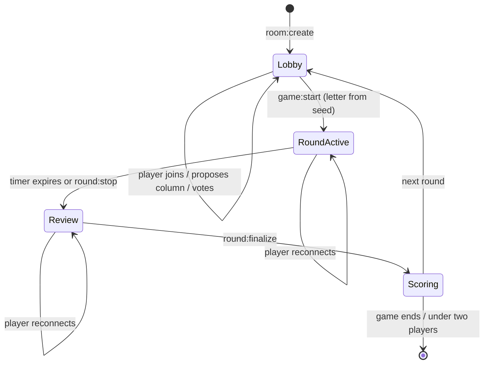

# Realtime model

## Authority, and what "shared rules" changes about it

The server owns ordering, the timer, and the persisted outcome. Clients send
intents and render state.

What the clients do _not_ do is guess at the rules, because they import the same
ones. `game-core` is a pure package with no runtime dependencies, and both sides
use it:

> No `Date.now`, no `Math.random`, no I/O, no framework imports: time and
> randomness are injected so every rule is deterministically testable and any
> disputed round is reproducible from its persisted seed. Both the server and the
> web client import these functions. Nothing in here may be reimplemented
> anywhere else — that is the entire point of the layer.

This is a different design from either full server-authority or client
prediction. Prediction means the client implements an approximation and gets
corrected; a shared rules layer means there is one implementation, so the client
and server cannot disagree about what a score _should_ be. They can only disagree
about what inputs existed, and that is what the server is authoritative for.

Injecting randomness rather than calling `Math.random` inside the rules is the
decision that makes disputes tractable. A round's letter derives from a persisted
seed, so "the game scored that wrong" is a claim you can replay rather than
argue about.

## The rules layer

| Module      | Responsibility                                          |
| ----------- | ------------------------------------------------------- |
| `normalize` | Canonical form of an answer before anything compares it |
| `validate`  | Is this a legal answer for this letter and category     |
| `blocklist` | Disallowed entries                                      |
| `grouping`  | Which answers count as the same answer                  |
| `scoring`   | Points, given groupings and review outcomes             |
| `review`    | Invalid-vote resolution                                 |
| `letters`   | Letter selection from an injected seed                  |
| `stop`      | Round-stop conditions                                   |

Every module has its own test file. `scoring.ts` is 260 lines against 224 lines
of tests.

The ordering matters: `normalize` feeds `grouping` feeds `scoring`. Duplicate
detection is inherently global — whether your answer scores full or half depends
on what everyone else wrote — so grouping has to happen over the whole round
before scoring runs.

## Room lifecycle



Reconnection is not a separate state. A returning player is resolved against the
room's current phase and re-sent the state for that phase, including their own
prior submissions. Treating reconnect as a distinct flow means writing recovery
logic per phase; resolving into the existing phase means one path.

Alongside it: presence lifecycle, seat holds for players who drop mid-round, idle
detection, departed-player handling, and an under-two-players shutdown. Each has
its own behaviour test.

## State ownership

| State                             | Home                         | Why                                         |
| --------------------------------- | ---------------------------- | ------------------------------------------- |
| Room, players, round, submissions | Redis, via `RoomRepo`        | Shared across instances; naturally expiring |
| Round lock                        | Redis, via `RoundLock`       | Must be visible to every instance           |
| Idempotency keys                  | `IdempotencyStore`           | Deduplicates repeated intents               |
| Socket-to-player mapping          | `socketRegistry`, in process | Tied to the connection, dies with it        |
| History, seasons, stats, profiles | PostgreSQL                   | Durable, queried outside gameplay           |

The split is by lifetime. Anything whose life equals the room's lives in Redis
under the room's TTL. Anything that outlives the room goes to Postgres. Anything
that dies with the socket stays in process, because persisting it would mean
cleaning it up.

## The lock

Room mutation is read-modify-write:

```
findById(roomId) → mutate in memory → save(room)
```

The store has no `WATCH` and no version field, so concurrent writers would
interleave and the later write would win wholesale. Rather than version the
store, every write path takes a distributed mutex:

```ts
async acquire(roomId: string, ttlMs = 10_000): Promise<string | null> {
  const token = randomUUID();
  const res = await this.redis.set(this.key(roomId), token, { NX: true, PX: ttlMs });
  return res === 'OK' ? token : null;
}
```

Release runs a Lua script that deletes the key only if the stored token still
matches. The TTL exists because a crashed holder must not wedge a room forever;
the token exists because the TTL introduces exactly that race — an expired holder
must not delete a lock someone else now owns.

`RoundLock` is an interface with `InMemoryRoundLock` and `RedisRoundLock`,
selected at boot on the same rule as the room repository.

### Making lock ownership visible

Entry points acquire through `acquireRoundLockWaiting(roomId)`, which retries
until it holds the lock. Internal operations that assume the lock is already held
say so in their names:

```
startGameWithLockHeld      endRoundWithLockHeld       finalizeRoundWithLockHeld
advanceReviewWithLockHeld  recheckReviewWithLockHeld  endGameWithLockHeld
handOffPickWithLockHeld    startRematchWithLockHeld   endIfUnderTwoWithLockHeld
```

The convention does the work a type system would otherwise have to. Calling
`endRoundWithLockHeld` without the lock is possible, but not accidental — the
name is the assertion.

The lock is not confined to `GameService`. `RoomService`, `LobbyService` and
`PresenceService` take the same one, and `roomLock.race.test.ts` states why:

> Redis hands each caller its own copy, so an unlocked write that read before a
> locked one saved puts the old room back.

That is the failure mode the test exists to prevent: a lobby write silently
reverting a round transition, which would look like a bug in the game rather than
a bug in the lobby.

### What it costs

A lock is a serialisation point, so writes to one room are no longer concurrent.
At the scale of a single lobby that is free. `acquireRoundLockWaiting` retries
rather than failing fast, so a pathologically slow holder delays callers instead
of erroring — acceptable while the critical sections stay short, and the thing to
watch if they stop being short.

## Idempotency

`IdempotencyStore.once(key, fn)` runs an action once and replays the stored
result for a repeated key. A duplicate `round:stop` — from a double-tap, a
flaky connection, or a client retry after a lost ack — is a no-op rather than a
second transition.

This is the necessary companion to acknowledgements. Acks tell a client its
intent failed so it can retry; idempotency is what makes retrying safe.

## Transport

`@socket.io/redis-adapter` fans events across instances via a pub/sub pair, so a
broadcast from any node reaches sockets on every other node.

Handlers are registered per lifecycle stage — `lobby`, `rooms`, `round`, `game`,
`disconnect` — and each is wrapped by `wrapAck`, so a rejected or failed intent
returns `{ ok: false, error }` rather than disappearing.

Event contracts live in `@nome-terra/shared` as `ClientToServerEvents` and
`ServerToClientEvents`. Backend, web and mobile all import them, so renaming an
event breaks every build at once — the failure mode you want, given the
alternative is an emit that silently matches no handler.
